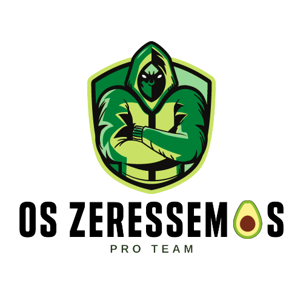

   &nbsp;&nbsp;&nbsp;&nbsp;&nbsp;&nbsp;&nbsp;&nbsp;&nbsp;&nbsp;&nbsp;&nbsp;&nbsp;&nbsp;&nbsp;&nbsp;&nbsp;&nbsp;&nbsp;&nbsp;&nbsp;&nbsp;&nbsp;&nbsp;&nbsp;&nbsp;&nbsp;&nbsp;&nbsp;&nbsp;&nbsp;&nbsp;&nbsp;&nbsp;&nbsp;&nbsp;&nbsp;&nbsp;&nbsp;&nbsp;&nbsp;&nbsp;&nbsp;&nbsp;&nbsp;&nbsp;&nbsp;&nbsp;&nbsp;&nbsp;&nbsp;&nbsp;&nbsp;&nbsp;&nbsp;&nbsp;&nbsp;&nbsp;&nbsp;&nbsp;&nbsp;&nbsp;&nbsp;&nbsp;&nbsp;&nbsp;&nbsp;&nbsp;&nbsp;&nbsp;&nbsp;

  

    <h2>

    Base</h2> 
  

<h1 align="center">Banco de Dados</h1>
<h3 align="center">Professor Alexandre de Oliveira Paixão</h3>

 

##  Conteúdo Programático

✔️ Entender os conceitos de entidade, atributo e relacionamento 
✔️ Saber mapear e projetar um banco de dados 
✔️ Criar um banco de dados (DDL Data Definition Language 
✔️ Manter a integridade referencial do banco de dados (chave) 
✔️ Manipular banco de dados (DML Data Manipulation Language) 
✔️ Consultar banco de dados (DQL Data Query Language) 
✔️ Consultar múltiplas tabelas de um banco de dados (junção de tabelas) 
✔️ Utilizar funções de agregação (soma, máximo, mínimo, média, etc) 
✔️ Fazer agrupamento 
✔️ Criar índices para pesquisa no banco de dados 
✔️ Entender o conceito de normalização de banco de dados

*Totalizando 42h*

 

##  Atividades

* [Exercícios](exercicios/)
* [Trabalhos de Pesquisa](trabalhosDePesquisa/)
* [Material de Aula](materialDeAula/) 

### ⚡Projeto Final 
 &nbsp;&nbsp;&nbsp;&nbsp;&nbsp;&nbsp;[**E-commerce Marketplace**](projetoFinal/)

 

##  Tecnologia Utilizada

- [**PostgreSQL**](https://www.postgresql.org/)    [(*Documentação*)](http://pgdocptbr.sourceforge.net/pg80/index.html)
- [**DBeaver**](https://dbeaver.io/)    [(*Documentação*)](https://dbeaver.com/docs/wiki/)
