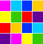

   &nbsp;&nbsp;&nbsp;&nbsp;&nbsp;&nbsp;&nbsp;&nbsp;&nbsp;&nbsp;&nbsp;&nbsp;&nbsp;&nbsp;&nbsp;&nbsp;&nbsp;&nbsp;&nbsp;&nbsp;&nbsp;&nbsp;&nbsp;&nbsp;&nbsp;&nbsp;&nbsp;&nbsp;&nbsp;&nbsp;&nbsp;&nbsp;&nbsp;&nbsp;&nbsp;&nbsp;&nbsp;&nbsp;&nbsp;&nbsp;&nbsp;&nbsp;&nbsp;&nbsp;&nbsp;&nbsp;&nbsp;&nbsp;&nbsp;&nbsp;&nbsp;&nbsp;&nbsp;&nbsp;&nbsp;&nbsp;&nbsp;&nbsp;&nbsp;&nbsp;&nbsp;&nbsp;&nbsp;&nbsp;&nbsp;&nbsp;&nbsp;&nbsp;&nbsp;&nbsp;&nbsp;

<h1 align="center">Modelagem de Sistemas</h1>
<h3 align="center">Professor Alexandre de Oliveira Paixão</h3>

 

##  Conteúdo Programático

✔️ Conhecer a UML. 
✔️ Entender e elaborar o diagrama de Casos de Uso. 
✔️ Entender e elaborar o diagrama de Classes. 
✔️ Entender e elaborar o diagrama de Sequência. 
✔️ Entender e elaborar o diagrama de Atividades. 
✔️ Entender e elaborar o diagrama de Estados. 
✔️ Entender e elaborar o diagrama de Componente.

*Totalizando 18h*

 

##  Listas e Exercícios
* [Atividades](atividades/)
* [Material de Aula](materialDeAula/) 

### ⚡Trabalho Final
 &nbsp;&nbsp;&nbsp;&nbsp;&nbsp;&nbsp;[**Diagramas UML E-commerce Marketplace**](trabalhoFinal/)

 

##  Tecnologia Utilizada

- [**UML Designer**](http://www.umldesigner.org/)    [*(Documentação)*](http://www.umldesigner.org/ref-doc/presentation.html)
- [**Draw.io**](https://drawio-app.com/product/)    [*(Documentação)*](https://drawio-app.com/tutorials/)
